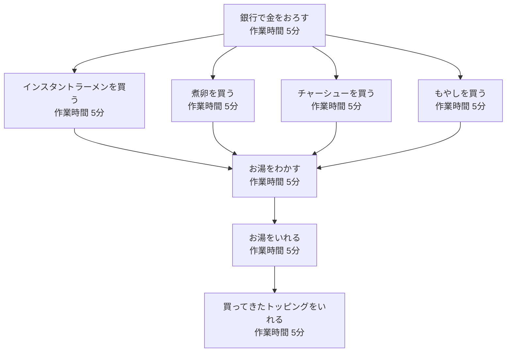

```mermaid
flowchart TB
    id1["銀行で金をおろす
    作業時間 5分"]
    id2["インスタントラーメンを買う
    作業時間 5分"]
    id3["煮卵を買う
    作業時間 5分"]
    id4["チャーシューを買う
    作業時間 5分"]
    id5["もやしを買う
    作業時間 5分"]
    id6["お湯をわかす
    作業時間 5分"]
    id7["お湯をいれる
    作業時間 5分"]
    id8["買ってきたトッピングをいれる
    作業時間 5分"]

    id1 --> id2
    id1 --> id3
    id1 --> id4
    id1 --> id5
    id2 --> id6
    id3 --> id6
    id4 --> id6
    id5 --> id6
    id6 --> id7
    id7 --> id8
```