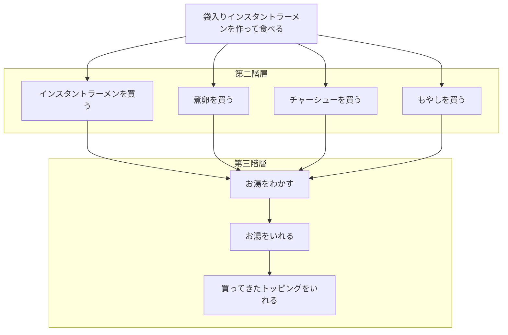

```mermaid
flowchart TB
    id1[袋入りインスタントラーメンを作って食べる]
    subgraph "第二階層"
    id2[インスタントラーメンを買う]
    id3[煮卵を買う]
    id4[チャーシューを買う]
    id5[もやしを買う]
    end
    subgraph "第三階層"
    id6[お湯をわかす]
    id7[お湯をいれる]
    id8[買ってきたトッピングをいれる]
    end
    id1 --> id2
    id1 --> id3
    id1 --> id4
    id1 --> id5
    id2 --> id6
    id3 --> id6
    id4 --> id6
    id5 --> id6
    id6 --> id7
    id7 --> id8
```