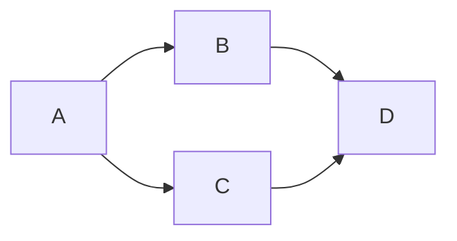
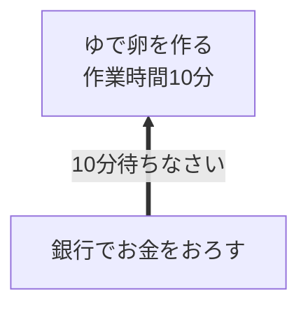
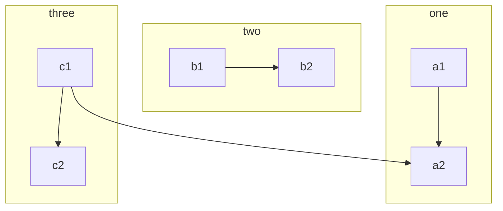
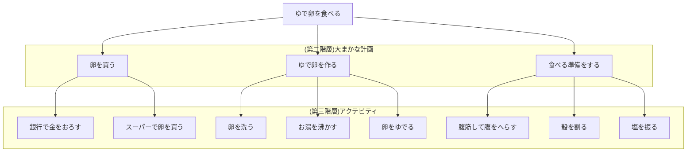
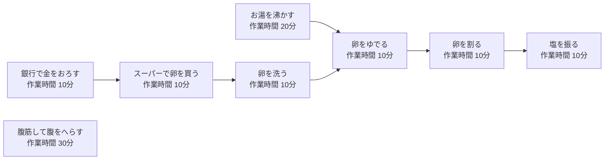

| アクテビティ | 担当 | 0-10分 | -20分 | -30分 | -40分 | -50分 | -60分 |
| ----- | ----- | ----- | ----- | ----- | ----- | ----- | -----|
| 銀行で金をおろす | 太郎 | ★ |
| スーパーで卵を買う | 太郎 |  | ★ |
| 卵を洗う | 太郎 |  |  | ★ |
| お湯を沸かす | 花子 |
| 卵をゆでる | 花子 |  |  |  | ★ |
| 腹筋して腹をへらす | 太郎 |
| 殻を割る | 花子 |  |  |  |  | ★ |
| 塩を振る | 花子 |  |  |  |  |  | ★ |