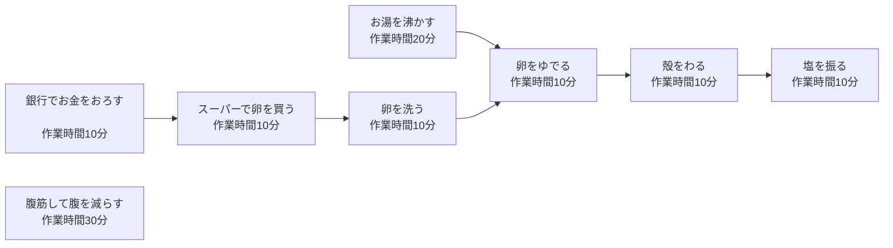

```mermaid

graph LR;

    id1a["銀行でお金をおろす

                  作業時間10分"]

    id1b["スーパーで卵を買う
                  作業時間10分"]
    id1c["卵を洗う
              作業時間10分"]
    id1d["お湯を沸かす
              作業時間20分"]
    id1e["卵をゆでる
              作業時間10分"]
    id1f["殻をわる
              作業時間10分"]
    id1g["塩を振る
              作業時間10分"]
    id1h["腹筋して腹を減らす
                作業時間30分"]

                
id1a-->id1b
id1b-->id1c
id1d-->id1e
id1e-->id1f
id1f-->id1g
id1c-->id1e
```